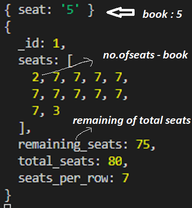
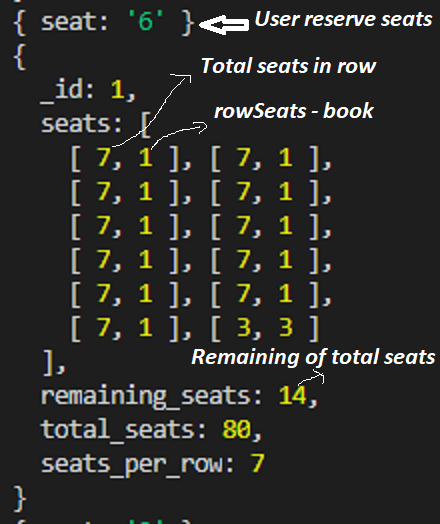
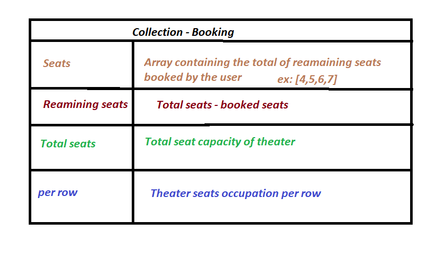

# Seating-Arrangement
Train Booking and Seating Arrangement

#### Technologies Used : 

```
    1. HTML
    2. CSS
    3. JavaScript.
    4. Server NodeJS(Express).
    5. ReactJS.
    7. MongoDB.
```

#### Install Packages : 

``` 
    Move to Client and Server folders
    Install the Packages : npm i
    Start clinet : npm start
    Start Server : nodemon server.js
```

### [Live Site(Go to live site and book ticket)](https://master.d1es9gzi0rwpvk.amplifyapp.com/)

#### Optimise response
##### the below reponse would cause load in frontend


#### another response
##### the below reponse would cause faster load in frontend


#### Database design

